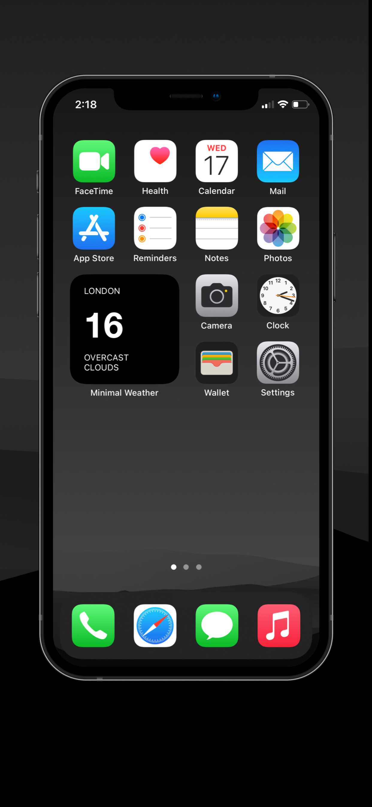
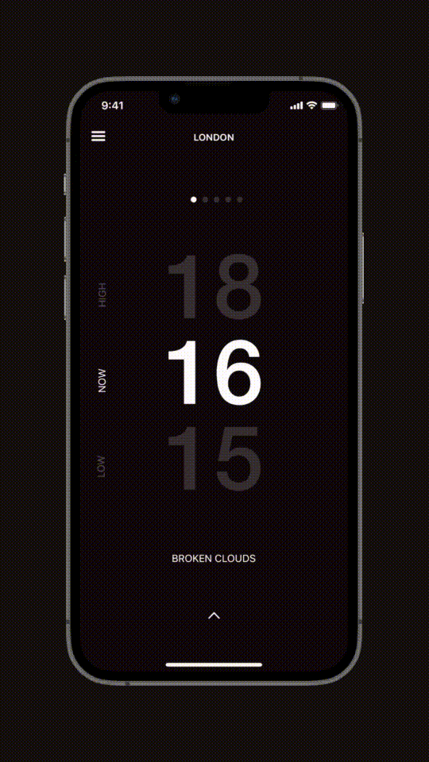

<p align="center"></p>

<div align="center">
<a href="https://github.com/himanshu-matharu/Minimalist-Weather-App/releases">

</a>
<a href="https://github.com/himanshu-matharu/Minimalist-Weather-App/blob/main/LICENSE">

</a>
</div>

## App Store link
<a href="https://apps.apple.com/us/app/minimal-weather/id1640216968?itsct=apps_box_badge&amp;itscg=30200" style="display: inline-block; overflow: hidden; border-radius: 13px; width: 250px; height: 83px;"></a>

# Description
A minimalistic weather app free from all the clutter and provides only the essential information.
Powered by OpenWeather, Minimal Weather uses location information to display the temperature in Celsius and the weather conditions.

UI of the app is based on design by <a href="https://dribbble.com/shots/17014294-Minimalistic-Weather-App?utm_source=Clipboard_Shot&utm_campaign=erdeibarna&utm_content=Minimalistic%20Weather%20App&utm_medium=Social_Share&utm_source=Clipboard_Shot&utm_campaign=erdeibarna&utm_content=Minimalistic%20Weather%20App&utm_medium=Social_Share">Barna Erdei</a>.

The Figma design file can be found <a href="https://www.figma.com/file/sjsWd5Z7oVFlCPUvMgPwpE/Minimal-Weather-iOS-App?node-id=0%3A1">here</a>.

<div>


</div>

# Tech Stack
A brief high-level overview of the tech stack used:
- The app is developed using Swift.
- The UI of the main app is built using the <a href="https://developer.apple.com/documentation/uikit/uistoryboard">Storyboard</a>.
- The UI of the widget is built using <a href="https://developer.apple.com/documentation/widgetkit/building_widgets_using_widgetkit_and_swiftui">SwiftUI</a>.
- For persistent storage (database), the app and widget use shared <a href="https://developer.apple.com/documentation/foundation/userdefaults">UserDefaults</a> via <a href="https://developer.apple.com/documentation/bundleresources/entitlements/com_apple_security_application-groups">App Group</a>.
- The weather data is fetched using the OpenWeather <a href="https://openweathermap.org/api">Current & Forecast weather data collection API</a>.

# Installation

1. Get a free API key at <a href="https://openweathermap.org/price">openweathermap.org</a>.
2. Clone the repo
```git
git clone https://github.com/himanshu-matharu/Minimalist-Weather-App.git
```
3. Open the project on XCode.
4. Put your API key in Constants.swift in the apiKey variable
```Swift
static let apiKey = "[Your api key]"
```
*The existing key in the file will not work as it has been disabled and you need your own new api key.*

5. Build and Run.

# License
The Minimal Weather app is free and open-source software licensed under the GNU General Public License v3.0. See the <a href="https://github.com/himanshu-matharu/Minimalist-Weather-App/blob/main/LICENSE">LICENSE</a> file for more details.

# Contact
For any queries, send me a mail on himanshumatharu1155@gmail.com
